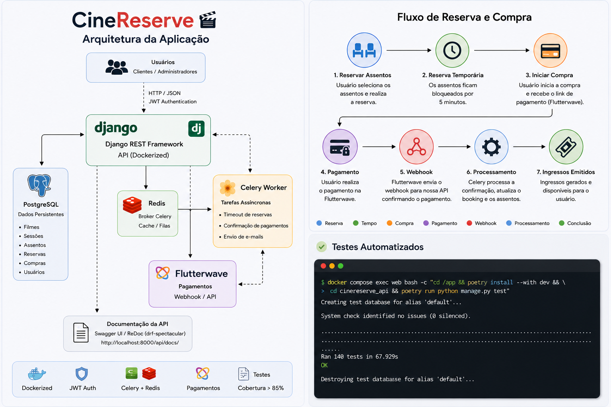
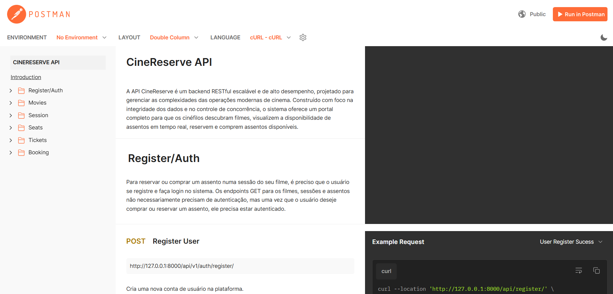
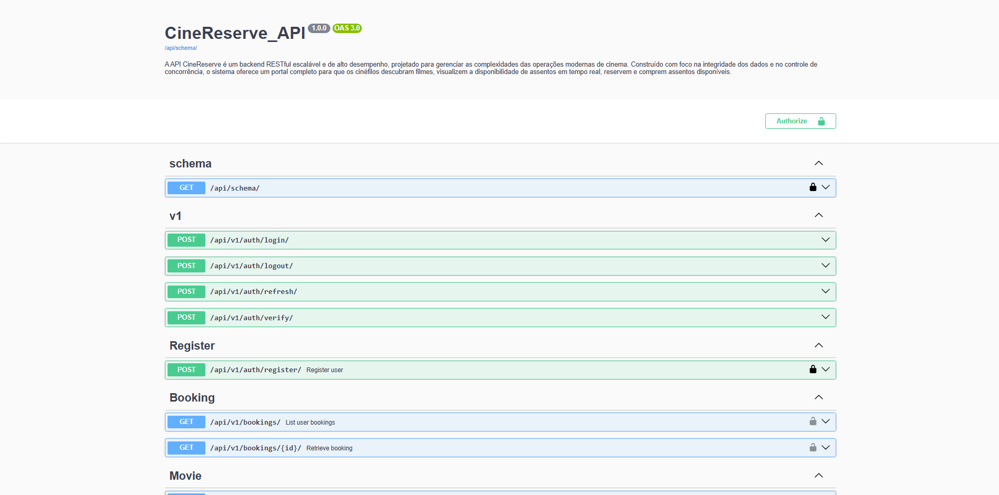
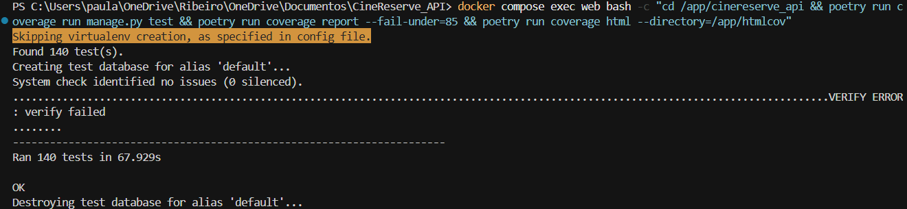
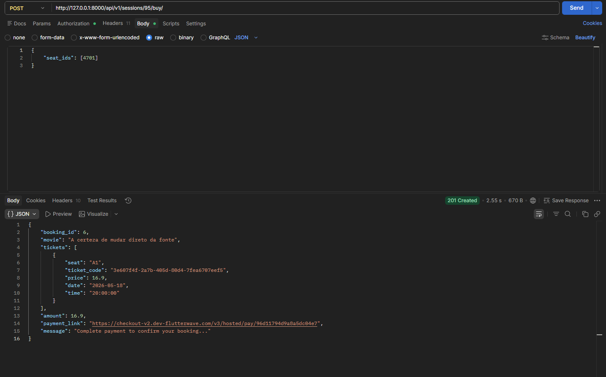
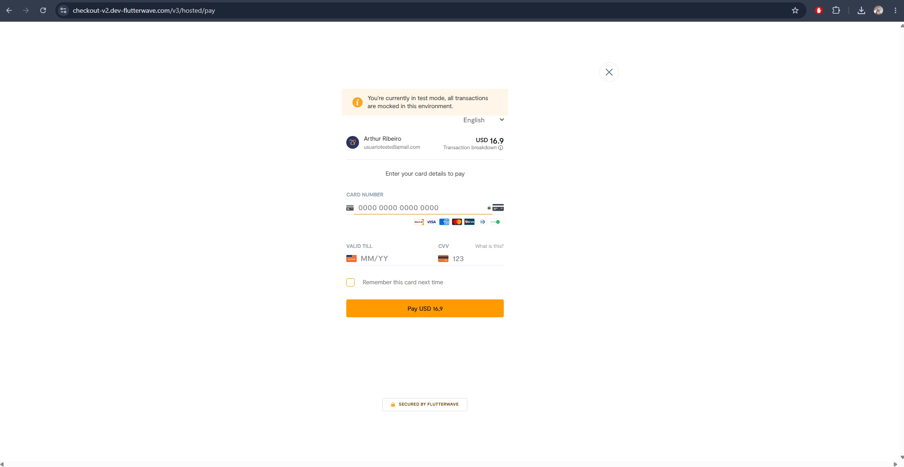

# CineReserve API

A API CineReserve é um backend RESTful escalável e de alto desempenho, projetado para gerenciar as complexidades das operações modernas de cinema. Construído com foco na integridade dos dados e no controle de concorrência, o sistema oferece um portal completo para que os cinéfilos descubram filmes, visualizem a disponibilidade de assentos em tempo real, reservem e comprem assentos disponíveis.

## Stack

- **Django 6** + **Django REST Framework**
- **PostgreSQL** (dados) + **Redis** (broker Celery)
- **Celery** (timeouts de reserva/compra e envio de e-mail)
- **JWT** (`djangorestframework-simplejwt`)
- **Flutterwave** (pagamentos)
- **drf-spectacular** (OpenAPI / Swagger / ReDoc)

## Arquitetura



## Pré-requisitos

- [Docker](https://www.docker.com/) e Docker Compose (v2: comando `docker compose`)
- Conta Flutterwave (chaves de API para pagamentos em ambiente de teste ou produção)

---

## Documentação da API

A documentação da API está disponível em:

- **Postman** — exemplos práticos de uso dos endpoints, autenticação e fluxos da aplicação.
- **Swagger/OpenAPI** — gerada automaticamente com `drf-spectacular`, para explorar e testar endpoints na interface web.
- **ReDoc** — visualização alternativa do schema OpenAPI, com navegação amigável.

### Documentação no Postman

https://documenter.getpostman.com/view/40491697/2sBXqRibqf



### Documentação local (com o projeto rodando)

| Recurso | URL |
|---------|-----|
| Swagger UI | http://localhost:8000/api/docs/ |
| ReDoc | http://localhost:8000/api/redoc/ |
| Schema OpenAPI (JSON/YAML) | http://localhost:8000/api/schema/ |
| Django Admin | http://localhost:8000/admin/ |

---



## Como rodar o projeto com Docker

### 1. Clonar o repositório

```bash
git clone https://github.com/ribeiro-7/CineReserve_API
cd CineReserve_API
```

### 2. Criar arquivo `.env`

Crie um arquivo `.env` na **raiz do projeto**, baseado em [`.env.example`](.env.example):

```env
# =========================
# Database Settings
# =========================

DB_NAME=nome_do_seu_bd
DB_USER=usuario_do_bd
DB_PASSWORD=senha_do_bd
DB_HOST=db
DB_PORT=5432

# =========================
# Django Settings
# =========================

SECRET_KEY=CHANGE-ME

# =========================
# Celery / Redis
# =========================

CELERY_BROKER_URL=redis://redis:6379/0

# =========================
# Flutterwave Settings
# =========================

FLW_PUBLIC_KEY=CHANGE-ME
FLW_SECRET_KEY=CHANGE-ME
FLW_ENCRYPTION_KEY=CHANGE-ME
FLW_SECRET_HASH=CHANGE-ME
FLW_REDIRECT_URL=https://SEU-DOMINIO.ngrok-free.dev/payments/callback/
NGROK_HOST=SEU-DOMINIO.ngrok-free.dev
```

Em desenvolvimento local, **completar um pagamento de ponta a ponta exige um túnel público** (ngrok ou equivalente). Sem isso, o `buy` funciona e gera o `payment_link`, mas a Flutterwave não consegue chamar o webhook na sua máquina — o booking fica `pending` e os ingressos não são confirmados. Ver [Pagamentos em desenvolvimento (ngrok)](#pagamentos-em-desenvolvimento-ngrok).

### 3. Subir os containers

```bash
docker compose up
```

Serviços iniciados pelo Compose:

| Serviço | Função |
|---------|--------|
| `web` | API Django (porta 8000) |
| `db` | PostgreSQL |
| `redis` | Broker do Celery |
| `worker` | Worker Celery (timeouts e e-mails) |

### 4. Rodar migrations

Em outro terminal:

```bash
docker compose exec web python cinereserve_api/manage.py makemigrations
docker compose exec web python cinereserve_api/manage.py migrate
```

### 5. Criar superusuário (opcional)

```bash
docker compose exec web python cinereserve_api/manage.py createsuperuser
```

### 6. Popular o banco (opcional)

Script `populate` para criar filmes, sessões, preços e mapas de assentos:

```bash
docker compose exec web python cinereserve_api/manage.py runscript populate
```

---

## Testes e coverage

Com os containers em execução:

Comando para rodar todos os testes:

```bash
docker compose exec web bash -c "cd /app && poetry install --with dev && cd cinereserve_api && poetry run python manage.py test"
```

Coverage (meta mínima de 85% em [`.coveragerc`](.coveragerc)) e geração do index.html em [`htmlcov`](htmlcov):

```bash
docker compose exec web bash -c "cd /app/cinereserve_api && poetry run coverage run manage.py test && poetry run coverage report --fail-under=85 && poetry run coverage html --directory=/app/htmlcov"
```

Os testes usam `settings_test` automaticamente (Celery eager, e-mail em memória) e mockam as chamadas HTTP à Flutterwave.



---

## Parar o projeto

```bash
# Ctrl + C no terminal do compose, depois:
docker compose down
```

---

## Fluxo de compra (pagamento)

1. **Reservar** — `POST /api/v1/sessions/{id}/reserve/` com `seat_ids` (IDs de `SeatSession`). Assentos ficam `Reserved` por 5 minutos.
2. **Comprar** — `POST /api/v1/sessions/{id}/buy/` com `seat_ids`. Cria booking `pending`, reserva os assentos e retorna `payment_link` (Flutterwave).
3. **Pagar** — o cliente conclui o pagamento no link da Flutterwave.
4. **Pagamento Mockado** - O flutterwave disponibiliza informações de cartões para testes no link: [Flutterwave Testing](https://developer.flutterwave.com/v3.0/docs/testing?utm_source=chatgpt.com#successful-payments)
5. **Webhook** — Flutterwave chama `POST /payments/webhook/`. Em sucesso: booking `completed`, assentos `Sold`, e-mail de confirmação (via Celery).
6. **Consultar** — tickets e bookings só aparecem nas listagens após o pagamento confirmado (`booking` com status `completed`).

Em **localhost**, os passos 3–4 dependem de URL pública (ngrok). Sem webhook, o pagamento na Flutterwave pode até ser aprovado, mas a API **não** finaliza a compra sozinha.

> Nos endpoints `reserve` e `buy`, o campo `seat_ids` deve conter os **IDs de `SeatSession`** (retornados em `GET /api/v1/sessions/{id}/seats/`), não os IDs da tabela `Seat`.




---

## Pagamentos em desenvolvimento (ngrok)

**Obrigatório para concluir pagamentos em local.** A API, o Swagger e as reservas funcionam em `localhost`, mas a Flutterwave está na internet e **não alcança** `127.0.0.1`. Sem ngrok (ou outro túnel), após o `buy` o booking permanece `pending` e os assentos não passam para `Sold`.

Os testes automatizados não precisam de ngrok — mockam a Flutterwave e simulam o webhook.

Com ngrok, a Flutterwave consegue:

- enviar o **webhook** (`POST /payments/webhook/`) — passo que confirma a compra na API;
- redirecionar o utilizador após o pagamento (`FLW_REDIRECT_URL` → `/payments/callback/`).

### Passos

1. Suba a API e o worker Celery:

   ```bash
   docker compose up
   ```

2. Em outro terminal, exponha a porta 8000:

   ```bash
   ngrok http 8000
   ```

3. Copie o domínio HTTPS gerado (ex.: `https://abc123.ngrok-free.dev`). O host é só a parte `abc123.ngrok-free.dev` (sem `https://`).

4. Atualize o `.env` na raiz do projeto:

   ```env
   NGROK_HOST=abc123.ngrok-free.dev
   FLW_REDIRECT_URL=https://abc123.ngrok-free.dev/payments/callback/
   ```

   O Django lê `NGROK_HOST` e adiciona-o a `ALLOWED_HOSTS` automaticamente ([`settings.py`](cinereserve_api/cinereserve_api/settings.py)). Reinicie os containers para aplicar:

   ```bash
   docker compose down && docker compose up
   ```

5. No [painel Flutterwave](https://dashboard.flutterwave.com/), configure o webhook para:

   ```text
   https://abc123.ngrok-free.dev/payments/webhook/
   ```

   O header `verif-hash` deve coincidir com `FLW_SECRET_HASH` no `.env`.

> Cada vez que o ngrok gerar um domínio novo (plano gratuito), repita os passos 3–5 e atualize `NGROK_HOST` e `FLW_REDIRECT_URL` no `.env`.

---

## Autenticação

Requer header `Authorization: Bearer <access_token>` nos endpoints protegidos.

| Método | Endpoint | Descrição |
|--------|----------|-----------|
| POST | `/api/v1/auth/register/` | Registrar usuário |
| POST | `/api/v1/auth/login/` | Login JWT (access + refresh) |
| POST | `/api/v1/auth/logout/` | Logout / blacklist do refresh token |
| POST | `/api/v1/auth/refresh/` | Renovar access token |
| POST | `/api/v1/auth/verify/` | Verificar access token |

---

## Movies

| Método | Endpoint | Descrição |
|--------|----------|-----------|
| GET | `/api/v1/movies/` | Listar filmes |
| GET | `/api/v1/movies/{id}/` | Detalhes do filme |
| POST | `/api/v1/movies/` | Criar filme (Admin) |
| PUT | `/api/v1/movies/{id}/` | Atualizar filme (Admin) |
| PATCH | `/api/v1/movies/{id}/` | Atualização parcial (Admin) |
| DELETE | `/api/v1/movies/{id}/` | Remover filme (Admin) |

---

## Sessions

| Método | Endpoint | Descrição |
|--------|----------|-----------|
| GET | `/api/v1/sessions/` | Listar sessões futuras |
| GET | `/api/v1/sessions/{id}/` | Detalhes da sessão |
| GET | `/api/v1/sessions/{id}/seats/` | Mapa de assentos (`SeatSession`) |
| POST | `/api/v1/sessions/` | Criar sessão (Admin) |
| PUT | `/api/v1/sessions/{id}/` | Atualizar sessão (Admin) |
| PATCH | `/api/v1/sessions/{id}/` | Atualização parcial (Admin) |
| DELETE | `/api/v1/sessions/{id}/` | Remover sessão (Admin) |

---

## Reservas e compras

| Método | Endpoint | Descrição |
|--------|----------|-----------|
| POST | `/api/v1/sessions/{id}/reserve/` | Reservar assentos (autenticado) |
| POST | `/api/v1/sessions/{id}/buy/` | Iniciar compra + link de pagamento (autenticado) |

Body (ambos):

```json
{
  "seat_ids": [1, 2, 3]
}
```

`seat_ids`: lista de IDs de **SeatSession** da sessão.

---

## Pagamentos

| Método | Endpoint | Descrição |
|--------|----------|-----------|
| GET | `/payments/callback/` | Redirect após pagamento na Flutterwave |
| POST | `/payments/webhook/` | Webhook Flutterwave (confirmação; header `verif-hash`) |

---

## Tickets

Apenas ingressos de bookings **completed**. Filtro opcional: `?type=upcoming` ou `?type=past`.

| Método | Endpoint | Descrição |
|--------|----------|-----------|
| GET | `/api/v1/tickets/` | Listar ingressos do usuário |
| GET | `/api/v1/tickets/{id}/` | Detalhes de um ingresso |

---

## Bookings

Filtro opcional: `?type=upcoming` ou `?type=past` (com base na data/hora da sessão).

| Método | Endpoint | Descrição |
|--------|----------|-----------|
| GET | `/api/v1/bookings/` | Listar compras do usuário |
| GET | `/api/v1/bookings/{id}/` | Detalhes de uma compra |